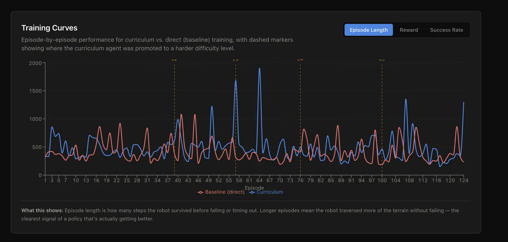
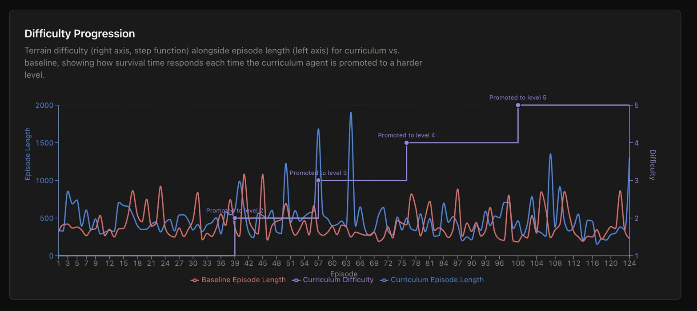

# Curriculum RL — Wheeled Robot Terrain Traversal

A from-scratch implementation of curriculum reinforcement learning applied to wheeled robot locomotion in MuJoCo. A two-wheeled robot learns to traverse increasingly difficult procedurally generated terrain using PPO, with an automatic curriculum scheduler that promotes difficulty based on rolling success rate.

**Key result: Curriculum learning achieved 15% higher episode survival on difficulty-5 terrain compared to direct training, using 77% less difficulty-5 training data.**

---

## Demo

### Training Curves


_Episode-by-episode performance for curriculum vs. baseline, with dashed markers showing difficulty promotions._

### Difficulty Progression


_Terrain difficulty stepping up as the policy improves, with episode length responding to each promotion._

### Robot Trajectory


_Top-down path of the trained robot colored by elevation — blue is low, red is high._

---

## Results

| Condition                | Avg Episode Length on Difficulty 5 | Timesteps on Difficulty 5 |
| ------------------------ | ---------------------------------- | ------------------------- |
| Curriculum (ours)        | **461 steps**                      | ~11,500                   |
| Baseline (no curriculum) | 400 steps                          | 50,000                    |

The curriculum policy achieved 15% higher survival on the hardest terrain despite spending 77% fewer timesteps training on it. The scheduler promoted through all 5 difficulty levels over ~100 episodes, with the characteristic dip-and-recover pattern visible at each promotion.

---

## How It Works

### Terrain System

Terrain is a 100x100 MuJoCo heightfield generated procedurally at 5 difficulty levels:

- **Level 1** — nearly flat, Gaussian smoothing sigma=5
- **Level 3** — moderate slopes and bumps, sigma=3
- **Level 5** — rough uneven terrain, minimal smoothing sigma=1

Higher difficulty means both larger random elevation values and less smoothing, producing sharper and more unpredictable terrain.

### Curriculum Scheduler

After every episode the scheduler checks the last 20 episodes. If 70% or more lasted at least 350 steps, the robot is promoted to the next difficulty level and terrain is immediately regenerated. The window resets on promotion so the next level is evaluated independently.

### Reward Function

Two components per timestep:

- **Velocity reward** — forward velocity clipped at 0.7 per step
- **Stability reward** — quaternion w value, 1.0 when upright, decreasing as the robot tilts

Episode terminates when quaternion w drops below 0.7, corresponding to ~90 degrees of tilt.

### Observation Space (7 dimensions)

| Index | Value                       |
| ----- | --------------------------- |
| 0     | z position (chassis height) |
| 1     | vx (lateral velocity)       |
| 2     | vy (forward velocity)       |
| 3-6   | quaternion (w, qx, qy, qz)  |

### Action Space (2 dimensions)

Left and right wheel torques in [-1, 1], scaled by gear ratio of 10 inside MuJoCo.

---

## Setup

```bash
git clone https://github.com/Mukund-Akella/curriculum-rl.git
cd curriculum-rl
python3 -m venv venv
source venv/bin/activate
pip install mujoco gymnasium stable-baselines3 scipy numpy matplotlib
```

## Running

```bash
PYTHONPATH=. python training/train.py          # curriculum training
PYTHONPATH=. python training/train_baseline.py # baseline training
PYTHONPATH=. python training/evaluate.py       # log robot trajectory
cd frontend && npm install && npm start         # launch dashboard
```

## Tech Stack

- [MuJoCo 3.10](https://mujoco.readthedocs.io/) — physics simulation
- [Gymnasium](https://gymnasium.farama.org/) — RL environment interface
- [Stable-Baselines3](https://stable-baselines3.readthedocs.io/) — PPO implementation
- [React](https://react.dev/) + [Recharts](https://recharts.org/) — frontend dashboard
- Python 3.11

## References

- Schulman et al. — [Proximal Policy Optimization Algorithms](https://arxiv.org/abs/1707.06347) (2017)
- Narvekar et al. — [Curriculum Learning for Reinforcement Learning Domains](https://arxiv.org/abs/2003.04960) (2020)
